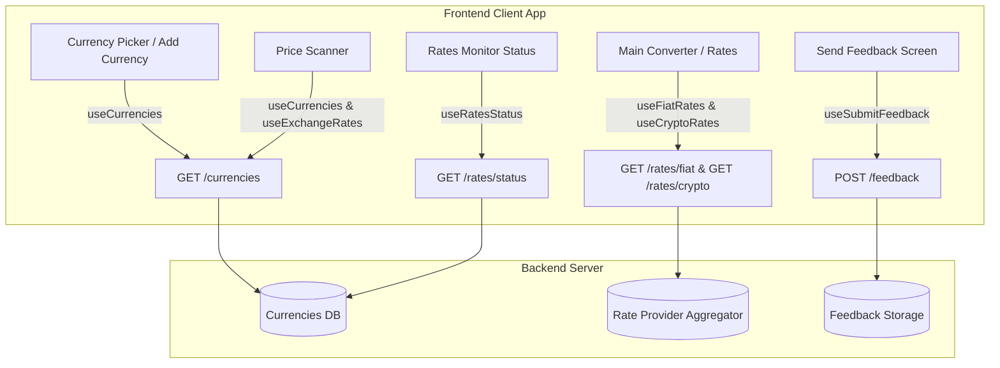

# Спецификация Backend API & Карта Функционала

Настоящий документ содержит полное описание API эндпоинтов, заголовков авторизации, форматов данных и внешних сервисов, используемых мобильным приложением **Convertoff Currency Converter**. Документ предназначен для разработчика бэкенда.

---

## 1. Общие сведения и Аутентификация

* **Базовый URL (Base URL)**: Конфигурируется через переменную окружения `EXPO_PUBLIC_API_URL` (например, `https://api.domain.com` в продакшене или `http://localhost:8088` в разработке).
* **Протокол & Формат**: HTTP / HTTPS, JSON.
* **Таймаут запросов**: 10 000 мс (10 секунд).
* **HTTP Заголовки (Headers)**:
  Каждый запрос от приложения отправляет следующие HTTP-заголовки:
  * `X-App-Service-Key`: Ключ авторизации приложения (из переменной `EXPO_PUBLIC_APP_SERVICE_KEY`).
  * `Accept`: `application/json`
  * `Content-Type`: `application/json`

---

## 2. Карта Эндпоинтов Бэкенда (API Reference)

### 2.1. Получение списка валют

* **HTTP Метод**: `GET`
* **Эндпоинт**: `/currencies`
* **Назначение**: Возвращает полный список поддерживаемых активных валют (как фиатных, так и криптовалют) для отображения в списках, селекторах и поиске.
* **Периодичность вызова**: Кэшируется на клиенте на **1 час** (`staleTime: 60 min`).
* **Файл кода**: `src/features/converter/api/use-rates.ts` (`useCurrencies`)

#### Формат ответа (`200 OK`):
```json
{
  "data": [
    {
      "code": "USD",
      "name": "US Dollar",
      "symbol": "$",
      "type": "fiat",
      "flag_emoji": "🇺🇸",
      "is_active": true,
      "sort_order": 1
    },
    {
      "code": "BTC",
      "name": "Bitcoin",
      "symbol": "₿",
      "type": "crypto",
      "flag_emoji": "🪙",
      "is_active": true,
      "sort_order": 100
    }
  ]
}
```

#### Схема полей объекта `Currency`:
| Поле | Тип | Описание |
| :--- | :--- | :--- |
| `code` | `string` | Уникальный ISO / символьный код валюты (например, `"USD"`, `"EUR"`, `"BTC"`) |
| `name` | `string` | Название валюты (например, `"US Dollar"`) |
| `symbol` | `string` | Символ валюты (например, `"$"`, `"€"`, `"₿"`) |
| `type` | `string` | Тип валюты: `"fiat"` или `"crypto"` |
| `flag_emoji` | `string` | Emoji флаг/значок для отображения (например, `"🇺🇸"`) |
| `is_active` | `boolean` | Флаг активности валюты на бэкенде |
| `sort_order` | `number` | Числовой индекс для сортировки в интерфейсе приложения |

---

### 2.2. Получение курсов фиатных валют

* **HTTP Метод**: `GET`
* **Эндпоинт**: `/rates/fiat`
* **Назначение**: Получение актуальных курсов обмена фиатных валют относительно базовой валюты (USD).
* **Периодичность вызова**: Кэшируется на клиенте на **5 минут** (`staleTime: 5 min`).
* **Файл кода**: `src/features/converter/api/use-rates.ts` (`useFiatRates`)

#### Формат ответа (`200 OK`):
```json
{
  "data": {
    "base": "USD",
    "provider": "ecb",
    "fetched_at": "2026-07-30T12:00:00Z",
    "rates": {
      "EUR": 0.9215,
      "GBP": 0.7840,
      "JPY": 153.25,
      "RUB": 85.50
    }
  }
}
```

#### Схема полей объекта `RatesEnvelope`:
| Поле | Тип | Описание |
| :--- | :--- | :--- |
| `base` | `string` | Базовая валюта (всегда `"USD"`) |
| `provider` | `string` | Название источника/провайдера данных на бэкенде |
| `fetched_at` | `string \| null` | Штамп времени в ISO формате (UTC), когда бэкенд обновил курсы |
| `rates` | `Record<string, number>` | Словарь `Код Валюты -> Курс к USD` |

---

### 2.3. Получение курсов криптовалют

* **HTTP Метод**: `GET`
* **Эндпоинт**: `/rates/crypto`
* **Назначение**: Получение актуальных котировок криптовалют относительно базовой валюты (USD).
* **Периодичность вызова**: Кэшируется на клиенте на **30 секунд**, автоматически обновляется каждые **60 секунд** (`refetchInterval: 60 sec`).
* **Файл кода**: `src/features/converter/api/use-rates.ts` (`useCryptoRates`)

#### Формат ответа (`200 OK`):
```json
{
  "data": {
    "base": "USD",
    "provider": "coincap",
    "fetched_at": "2026-07-30T13:05:00Z",
    "rates": {
      "BTC": 67450.20,
      "ETH": 3480.75,
      "USDT": 1.00,
      "SOL": 182.30
    }
  }
}
```

---

### 2.4. Статус обновления курсов

* **HTTP Метод**: `GET`
* **Эндпоинт**: `/rates/status`
* **Назначение**: Получение информации о времени последнего успешного обновления курсов на стороне бэкенда.
* **Периодичность вызова**: Авто-опрос каждые **60 секунд**.
* **Файл кода**: `src/features/converter/api/use-rates.ts` (`useRatesStatus`)

#### Формат ответа (`200 OK`):
```json
{
  "data": {
    "fiat_updated_at": "2026-07-30T12:00:00Z",
    "crypto_updated_at": "2026-07-30T13:05:00Z"
  }
}
```

#### Схема полей объекта `RatesStatus`:
| Поле | Тип | Описание |
| :--- | :--- | :--- |
| `fiat_updated_at` | `string \| null` | Время последнего парсинга/обновления фиатных курсов бэкендом (ISO string) |
| `crypto_updated_at` | `string \| null` | Время последнего обновления крипто курсов бэкендом (ISO string) |

---

### 2.5. Отправка обратной связи (Feedback)

* **HTTP Метод**: `POST`
* **Эндпоинт**: `/feedback`
* **Назначение**: Отправка ответа пользователя на опрос/причину обратной связи.
* **Файл кода**: `src/features/converter/api/use-feedback.ts` (`useSubmitFeedback`)

#### Payload (Тело запроса):
```json
{
  "option_id": "too_expensive"
}
```

#### Поля запроса:
| Поле | Тип | Обязательное | Описание |
| :--- | :--- | :--- | :--- |
| `option_id` | `string` | Да | Идентификатор выбранной опции в UI приложения |

#### Ожидаемый ответ (`200 OK` или `201 Created`):
* Пустое тело или признак успешной записи `{ "success": true }`.

---

## 3. Схема взаимодействия приложения и бэкенда



---

## 4. Внешние Сервисы & CDN (Third-Party Integrations)

Кроме бэкенда приложения, мобильный клиент совершает обращения к следующим внешним ресурсам:

1. **FlagCDN (Иконки национальных флагов)**
   * **URL**: `https://flagcdn.com/w80/{country_code}.png`
   * **Назначение**: Отрисовка флага страны по 2-буквенному коду (например, `us`, `eu`, `gb`).
   * **Исходный код**: `src/components/flag-icon.tsx`

2. **CoinCap CDN (Иконки криптовалют)**
   * **URL**: `https://assets.coincap.io/assets/icons/{crypto_code}@2x.png`
   * **Назначение**: Отрисовка логотипа популярной криптовалюты (например, `btc`, `eth`, `sol`).
   * **Исходный код**: `src/components/flag-icon.tsx`

3. **In-App Purchases (Apple App Store / Google Play Billing)**
   * Интеграция выполняется через SDK `expo-iap` напрямую с магазинами приложений для проверки подписок Pro и обработки транзакций.
   * **Исходный код**: `src/features/iap/use-pro-purchase.ts`, `src/features/iap/use-pro-status-sync.ts`

4. **Google AdMob (Реклама)**
   * Интеграция межстраничной рекламы через Google Mobile Ads SDK.
   * **Исходный код**: `src/features/ads/use-interstitial-gate.ts`
